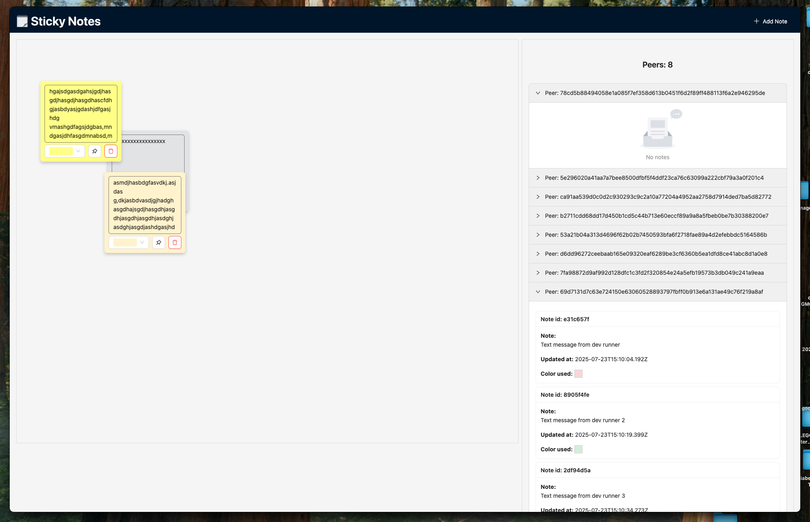

# 📝 Pear React Sticky Notes

## 📸 Screenshot



## 🚀 Features

- 📌 Create, edit, and delete sticky notes
- 🟨 Drag-and-drop functionality with position persistence
- 🤝 Real-time sync using Pear and Hypercore
- 🎨 Styled using Ant Design components
- 🧠 Context API for state management

## 📦 Tech Stack

- **React**
- **Ant Design**
- **Pear SDK**
- **Hypercore**
- **Context API**
- **react-draggable**

## 🛠️ Getting Started

### Prerequisites

- Node.js (v18+ recommended)
- npm or yarn

### Installation

```bash
git clone https://github.com/rob-aslanian/pear-react-sticky-note.git
cd pear-react-sticky-note
npm install
```

### Run in Dev Mode

```bash
npm run dev
```

## 🧪 Usage

1. Run the app
2. Click "Add Note" to create a sticky.
3. Drag notes anywhere.
4. To connect a several peers use that command in separate terminals

```
$ pear run -s /tmp/fs1 .

$ pear run -s /tmp/fs2 .

........................
```

4. Notes sync across connected peers automatically.

## 📝 TODO / Improvements

- [ ] Migrate to **Vite** for faster builds
- [ ] Rewrite in **TypeScript** for better type safety
- [ ] Replace CSS files with **Tailwind CSS** utility classes
- [ ] Add **persistent localStorage** or IndexedDB fallback for offline use
- [ ] Add **user presence indicators** (avatars of connected users)
- [ ] Optimize peer connection handling and error boundaries
